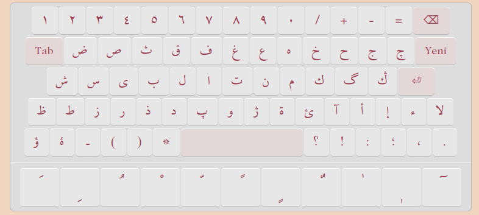

# Arabic and Ottoman Keyboard Application 2.0

An online keyboard application for Ottoman Turkish and Arabic.
Type words using the on-screen keyboard and improve your skills!

This application provides a complete Ottoman Turkish keyboard.
The keyboard has been updated and optimized for writing in Ottoman Turkish.
You can copy everything you type.

Pay attention to extra letters and reading marks.
For Arabic and Persian words, refer to dictionary books.
You can also use diacritics—simply click the letter first, then select the diacritic.

# Arapça ve Osmanlıca Klavye Uygulaması 2.0

Osmanlıca ve Arapça Online Klavye Uygulaması.
Ekran klavyesi ile kelimeler yazın ve kendinizi geliştirin!

Bu uygulama tam bir Osmanlıca klavye sunuyor.
Klavye yenilendi ve Osmanlıca yazmak için elverişli hale getirildi.
Bütün yazdıklarınızı kopyalayabilirsiniz.

Ek alan kelimelere ve okutucu harflere dikkat edin.
Arapça ve Farsça kelimeler için Lügat kitaplarına müracaat ediniz.
Ayrıca harekeleri de kullanabilirsiniz. Bunun için, önce harfi, sonra harekesini tıklayınız.
